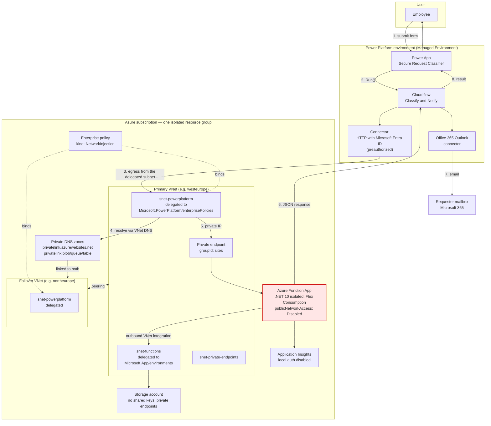
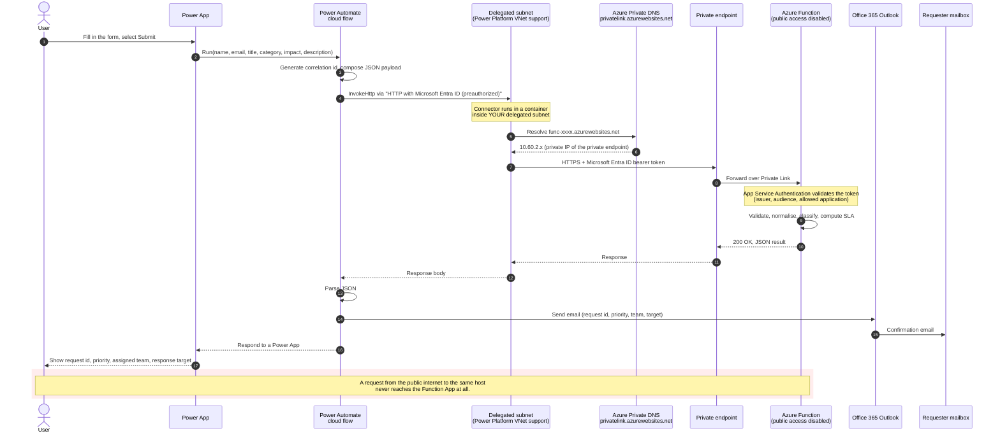
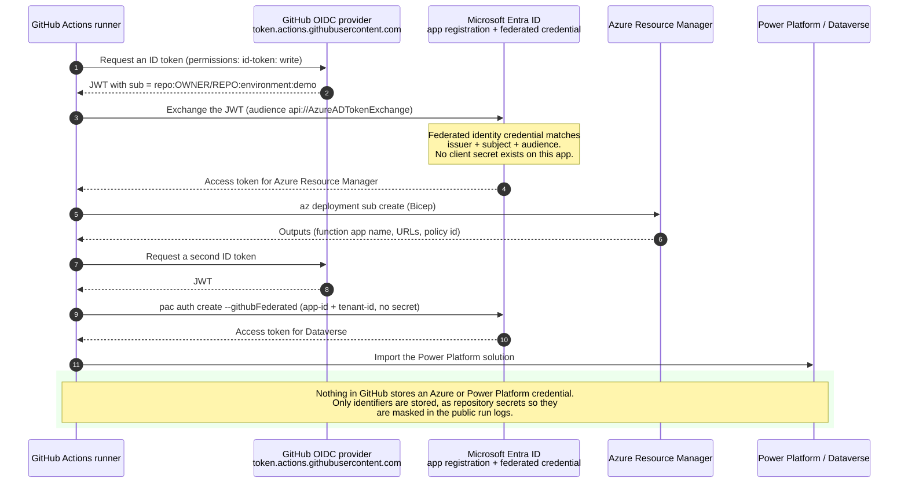

# Secure Request Classifier

A complete, self-contained demonstration of **Microsoft Power Platform calling a private Azure Function over private networking**, with the Function App's public endpoint switched off, deployed entirely by GitHub Actions using federated identity.

Everything is in this repository: the Azure infrastructure, the application code, the Power Platform solution, the CI/CD pipelines, the verification checks and the cleanup path.

---

## What this demonstrates

| Claim | How this repository proves it |
| --- | --- |
| A Power App and cloud flow can reach a backend that has **no public endpoint** | The Function App ships with `publicNetworkAccess: Disabled`; the flow reaches it through the Power Platform delegated subnet and a private endpoint |
| Power Platform traffic can be pinned into **your** virtual network | A `Microsoft.PowerPlatform/enterprisePolicies` network-injection policy binds delegated subnets in both Azure regions of the Power Platform region pair |
| Backend authentication needs **no shared secret** | App Service Authentication validates Microsoft Entra ID tokens; no client secret, no Function key, no SAS token |
| Azure access needs **no stored credential** | GitHub OIDC / workload identity federation for both Azure **and** Power Platform. A CI job fails the build if any workflow references a stored credential; only non-credential identifiers are allow-listed |
| The whole thing is **source controlled** | Infrastructure (Bicep), application (.NET 10), Power Platform solution (unpacked), pipelines (Actions), docs |
| It coexists with enterprise governance | No hub networking, no shared DNS zones, no pre-existing resources; Azure Landing Zone coexistence switches are parameters |

---

## Business scenario

An employee submits a simple internal request — a broken laptop, a meeting-room problem, an HR question. The organisation wants that request triaged consistently, and wants the triage logic to live in Azure on a service that is **not reachable from the internet**.

1. The employee fills in a short form in the **Secure Request Classifier** Power App.
2. The app calls a **solution-aware Power Automate cloud flow**.
3. The flow calls an **HTTP-triggered Azure Function** over private networking.
4. The Function validates and normalises the request, generates a request ID, derives a priority, assigns a responsible team and calculates a response target — using plain deterministic rules, no AI.
5. The flow emails the requester through **Office 365 Outlook**.
6. The result is returned to the app and displayed.

The application logic is deliberately small. The interesting part is the network path and the identity model.

---

## Architecture overview



**The Function App has no public endpoint.** The only way in is the private endpoint, reachable from the delegated subnet.

### Request sequence



### Deployment identity



---

## Repository structure

```
.
├── .github/
│   └── workflows/
│       ├── deploy.yml            Primary orchestrator: validate → infra → function → Power Platform → verify
│       ├── ci.yml                Build, test, lint, and enforce the security invariants
│       └── destroy.yml           Guarded cleanup
├── src/
│   └── function/
│       ├── SecureRequestClassifier.Functions/        .NET 10 isolated-worker Function App
│       │   ├── Configuration/    Options + start-up validation
│       │   ├── Endpoints/        HTTP triggers (classify, health)
│       │   ├── Models/           Request, response, problem and health contracts
│       │   └── Services/         Deterministic classifier, validator, Easy Auth principal reader
│       └── SecureRequestClassifier.Functions.Tests/  xUnit tests (98 cases)
├── infra/
│   ├── main.bicep                Subscription-scope orchestrator
│   ├── bicepconfig.json          Linter configuration
│   ├── modules/
│   │   ├── virtual-network.bicep
│   │   ├── virtual-network-peering.bicep
│   │   ├── network-security-group.bicep
│   │   ├── private-dns-zone.bicep
│   │   ├── private-endpoint.bicep
│   │   ├── storage.bicep
│   │   ├── monitoring.bicep
│   │   ├── function-app.bicep
│   │   ├── role-assignment.bicep
│   │   └── power-platform-enterprise-policy.bicep
│   └── parameters/
│       └── demo.bicepparam       Safe, committable demo defaults
├── powerplatform/
│   ├── solution/src/             Unpacked, source-controlled solution
│   │   ├── Other/                Solution.xml, Customizations.xml, Relationships.xml
│   │   ├── Workflows/            The cloud flow definition (Logic App JSON + metadata)
│   │   └── environmentvariabledefinitions/
│   ├── canvas-app/src/           Power Fx YAML source for the canvas app
│   └── config/
│       └── deploymentSettings.template.json
├── scripts/
│   ├── Initialize-EntraResources.ps1       One-time bootstrap, creates no secrets
│   ├── Build-Solution.ps1                  Packs the Power Platform solution
│   ├── New-DeploymentSettings.ps1          Renders the deployment settings file
│   ├── Set-FunctionAppDeploymentWindow.ps1 Opens/closes the transient deployment window
│   ├── Set-PowerPlatformSubnetInjection.ps1 Links the environment to the enterprise policy
│   ├── Test-Deployment.ps1                 30+ post-deployment assertions
│   ├── Invoke-PrivateConnectivityProbe.ps1 Proves private reachability and public unreachability
│   └── Remove-Demo.ps1                     Guarded cleanup
├── docs/
│   ├── architecture.md           Component-by-component walkthrough
│   ├── networking-model.md       Subnets, delegation, DNS, region pairing
│   ├── security-model.md         Every control and what it defends against
│   ├── identity-model.md         Every identity and what it can do
│   ├── deployment.md             Step-by-step deployment and configuration reference
│   ├── demo-script.md            Presenter's guide for a customer demonstration
│   ├── verification.md           What is checked and how to check it manually
│   ├── troubleshooting.md        Symptom → cause → fix
│   └── limitations.md            What cannot be automated, why, with citations
├── global.json
├── SecureRequestClassifier.slnx
└── README.md
```

---

## Prerequisites

### Azure
* An Azure subscription. It may sit inside an Azure Landing Zone; see [docs/deployment.md](docs/deployment.md#azure-landing-zone-coexistence).
* Permission to create app registrations and role assignments in Microsoft Entra ID (Application Administrator or Cloud Application Administrator, plus the ability to assign Azure roles).
* Resource providers `Microsoft.Network`, `Microsoft.Web`, `Microsoft.App`, `Microsoft.Storage`, `Microsoft.PowerPlatform`, `Microsoft.Insights`, `Microsoft.OperationalInsights` — the deploy workflow registers these automatically.

### Power Platform
* A Power Platform environment of type **Production**, **Sandbox**, **Developer** or **Default**. Trial and Dataverse for Teams environments are **not** supported by VNet support.
* The environment must be a **Managed Environment**. This is a hard prerequisite of Power Platform VNet support.
* An Azure subscription must be associated with the Power Platform tenant.
* Power Platform Administrator (or Dynamics 365 Administrator) to link the enterprise policy.
* The environment's Power Platform geography must have a documented Azure region pair. See [docs/networking-model.md](docs/networking-model.md#region-pairing).

### Local tooling (only for the one-time bootstrap)
* [Azure CLI](https://learn.microsoft.com/cli/azure/install-azure-cli) 2.60+
* [PowerShell 7](https://learn.microsoft.com/powershell/scripting/install/installing-powershell)
* [Power Platform CLI](https://learn.microsoft.com/power-platform/developer/cli/introduction) (`pac`) 2.7+
* [GitHub CLI](https://cli.github.com/) (optional, for setting repository secrets quickly)

Local .NET, Bicep and Node tooling are **not** required — GitHub Actions does the building.

---

## Deployment

The full, annotated walkthrough is in **[docs/deployment.md](docs/deployment.md)**. The short version:

### 1. Fork or clone, then bootstrap identity (once)

```powershell
az login
pwsh ./scripts/Initialize-EntraResources.ps1 `
    -GitHubRepository <owner>/<repo> `
    -SubscriptionId   <subscription-guid>
```

This creates the deployment app registration with a **federated credential** (no client secret), the API app registration, the delegated permission grant for the connector, and the least-privilege Azure role assignments. It prints the repository secrets to set and the exact `gh secret set` commands.

### 2. Set repository secrets and variables

None of the values below is a credential — they are identifiers, and nothing here grants access on its own. The tenant-specific ones are still stored as **secrets** rather than variables, for one practical reason: **GitHub masks secrets in run logs and step summaries, and does not mask variables.** This repository is public, so anything held in a variable would be printed in the clear on the first successful deployment.

Settings → Secrets and variables → Actions → *Secrets*:

| Secret | Required | Example |
| --- | --- | --- |
| `AZURE_CLIENT_ID` | yes | `11111111-…` |
| `AZURE_TENANT_ID` | yes | `22222222-…` |
| `AZURE_SUBSCRIPTION_ID` | yes | `33333333-…` |
| `AZURE_API_APP_ID` | yes | `44444444-…` |
| `AZURE_API_APP_ID_URI` | yes | `api://44444444-…` |
| `POWER_PLATFORM_APP_ID` | for solution import | same as `AZURE_CLIENT_ID` |
| `POWER_PLATFORM_TENANT_ID` | for solution import | same as `AZURE_TENANT_ID` |
| `POWER_PLATFORM_ADMIN_OBJECT_ID` | recommended | object id that will link the policy |
| `POWER_PLATFORM_CONNECTION_ID_*` | optional | see [docs/limitations.md](docs/limitations.md) |

Settings → Secrets and variables → Actions → *Variables* (non-sensitive configuration):

| Variable | Required | Example |
| --- | --- | --- |
| `POWER_PLATFORM_REGION` | recommended | `europe` |
| `POWER_PLATFORM_ENVIRONMENT_NAME` | optional | `srclass-demo` (default) |
| `AZURE_LOCATION` | optional | `westeurope` |
| `FUNCTION_DEPLOY_MODE` | optional | `deployment-window` (default) or `private-runner` |

You never supply the environment ID or Dataverse URL. The Deploy workflow provisions the
environment and each later stage resolves it by display name. They are deliberately not passed
between jobs: both are masked, and GitHub redacts any job output whose value contains a secret,
so passing them that way would silently yield an empty string.

The full table, including the Azure Landing Zone switches, is in [docs/deployment.md](docs/deployment.md#configuration-reference).

### 3. Complete the Power Platform prerequisites (once)

```powershell
# Enable Managed Environments (required by VNet support)
pac admin set-governance-config --environment <environment-id> --protection-level Standard

# Let the deployment identity import solutions
pac admin assign-user --environment <environment-id> `
    --user <AZURE_CLIENT_ID> --role "System administrator" --application-user
```

Then grant the deployment app registration the **Power Platform Administrator** role in Microsoft Entra ID so it can link the enterprise policy.

### 4. Run the workflow

Actions → **Deploy** → *Run workflow*.

One run performs validation, Azure infrastructure, Function build and deployment, enterprise-policy linking, Power Platform solution import, and post-deployment verification.

---

## Identity model

Five distinct identities, each with the narrowest job that works.

| Identity | Type | Authenticates with | Can do |
| --- | --- | --- | --- |
| GitHub Actions deployment identity | Entra app registration | **Federated credential** (GitHub OIDC). No secret exists. | Contributor + Role Based Access Control Administrator on the subscription; Dataverse System Administrator; Power Platform Administrator |
| Function App | System-assigned managed identity | Managed identity | Storage Blob Data Owner / Queue / Table Contributor on **its own** storage account; Monitoring Metrics Publisher on **its own** Application Insights. Nothing else. |
| Function API | Entra app registration | Nothing — it is a token *audience* | Exposes `api://<appId>/user_impersonation`; validated by App Service Authentication |
| HTTP with Microsoft Entra ID connector | Microsoft first-party app `d2ebd3a9-1ada-4480-8b2d-eac162716601` | Delegated user consent | Obtains a token for the API on behalf of the signed-in user. Listed in `allowedApplications` |
| Signed-in user | Entra user | Interactive | Runs the app; their identity flows through to the Function |

Details, including exactly what each grant permits, are in [docs/identity-model.md](docs/identity-model.md).

---

## Networking model

| Subnet | Virtual network | Delegation | Purpose |
| --- | --- | --- | --- |
| `snet-powerplatform` | primary **and** failover | `Microsoft.PowerPlatform/enterprisePolicies` | Where Power Platform connector containers run |
| `snet-functions` | primary | `Microsoft.App/environments` | Function App outbound VNet integration |
| `snet-private-endpoints` | primary | none | Private endpoints for the Function App and storage |

Every subnet carries a network security group — Azure Landing Zones assign
`Deny-Subnet-Without-Nsg` as a `Deny` effect, so a subnet without one simply cannot be created.

Key points, each explained in [docs/networking-model.md](docs/networking-model.md):

* **Two virtual networks are mandatory** in a paired Power Platform geography. A Power Platform environment can fail over between the two Azure regions of its region pair, so both need a delegated subnet, and they are peered so the failover region can still reach the private endpoints.
* **Private DNS zones are linked to both networks.** Power Platform resolves names using the DNS configured on the virtual network the delegated subnet lives in. A zone linked to only one network resolves to a public IP address after a failover.
* **The delegated subnet is dedicated.** It cannot hold private endpoints or any other resource, and it cannot be shared between enterprise policies.
* **The three delegations are different services.** Power Platform and Flex Consumption cannot share a subnet.

---

## Security model

| Control | Setting | What it prevents |
| --- | --- | --- |
| No public endpoint | `publicNetworkAccess: Disabled` on the Function App | Any internet-originated request, including to the SCM/Kudu site |
| Private ingress only | Private endpoint, `groupId: sites` | Traffic that has not traversed your network |
| Microsoft Entra ID authentication | `authsettingsV2`, `requireAuthentication: true`, `unauthenticatedClientAction: Return401` | Unauthenticated calls, even from inside the network |
| Caller allow-list | `defaultAuthorizationPolicy.allowedApplications` | Any application other than the approved connector |
| No Function keys | Every trigger is `AuthorizationLevel.Anonymous` behind Easy Auth | A leaked key granting access |
| No storage keys or SAS | `allowSharedKeyAccess: false` | Key- or SAS-based access to the deployment package or host storage |
| No publishing credentials | SCM and FTP basic auth policies set to `allow: false` | Username/password deployment |
| No telemetry key | Application Insights `DisableLocalAuth: true` | Instrumentation-key-as-credential |
| No stored CI credentials | GitHub OIDC for Azure *and* Power Platform | Credential theft from the repository or its settings |
| Least privilege | Scoped data-plane roles; `Role Based Access Control Administrator` instead of `Owner` | Lateral movement |

A CI job (`security-invariants`) fails the build if any of these regress. See [docs/security-model.md](docs/security-model.md).

---

## How to run the demo

1. Open the **Secure Request Classifier** app in Power Apps.
2. Enter a requester name and email, a title, pick a category and impact, add a description.
3. Select **Submit**.
4. The app shows the request ID, priority, assigned team and response target.
5. The requester receives the confirmation email.

If the canvas app has not been imported yet, run the **Classify and Notify** flow directly from Power Automate — the PowerApps (V2) trigger renders the same input form and exercises the identical network path.

The presenter's script, with talking points for each stage, is in **[docs/demo-script.md](docs/demo-script.md)**.

---

## Validating private connectivity

```powershell
# 30+ assertions: public access disabled, private endpoint approved, DNS records present,
# RBAC correct, delegations correct, no shared keys, and more.
pwsh ./scripts/Test-Deployment.ps1 -ResourceGroupName rg-srclass-demo

# Two live probes: from the public internet (must fail) and from inside the VNet (must succeed).
pwsh ./scripts/Invoke-PrivateConnectivityProbe.ps1 -ResourceGroupName rg-srclass-demo
```

Manual checks, including `nslookup` from the delegated subnet using Microsoft's own diagnostics cmdlets, are in [docs/verification.md](docs/verification.md).

---

## Configuration

Behaviour is controlled by Bicep parameters (see `infra/parameters/demo.bicepparam`) and GitHub repository secrets and variables. Nothing in this repository is tied to a particular tenant, subscription or environment; the defaults are generic and safe.

The full reference is in [docs/deployment.md](docs/deployment.md#configuration-reference).

---

## Troubleshooting

Common symptoms and their causes are catalogued in **[docs/troubleshooting.md](docs/troubleshooting.md)**, including:

* the flow returns 403 after the connection was created successfully;
* the host name resolves to a public IP address from the delegated subnet;
* the function deploy step fails with a connection timeout;
* `Enable-SubnetInjection` reports that the policy cannot be read.

---

## Cleanup

```powershell
pwsh ./scripts/Remove-Demo.ps1 `
    -ResourceGroupName            rg-srclass-demo `
    -PowerPlatformEnvironmentId   <environment-id> `
    -PowerPlatformEnvironmentUrl  https://contoso.crm4.dynamics.com `
    -RemoveEntraApplications
```

or run the **Destroy** workflow and type `DESTROY` to confirm.

The script unlinks the Power Platform environment from the enterprise policy *before* deleting the networks, and refuses to delete a resource group that is not tagged `workload=secure-request-classifier`. Because the demo never touches hub networking, shared DNS zones or any pre-existing resource, deleting that one resource group is complete and safe.

---

## Known limitations

Fully documented, with citations, in **[docs/limitations.md](docs/limitations.md)**. Summary:

1. **The canvas app binary cannot be built from source in CI.** `pac canvas pack` is deprecated and refuses to pack YAML that has not been validated by opening the app once in Power Apps Studio. The app's Power Fx source is committed; the one-time action that produces the `.msapp` is documented. The flow — and therefore the entire private-networking demonstration — deploys and runs without it.
2. **The connector connection must be created once by a person.** The `EntraAuth` connection type on the "HTTP with Microsoft Entra ID (preauthorized)" connector is a delegated-user connection with no service-principal option. CI binds the existing connection by ID.
3. **Linking the enterprise policy to an environment is not an ARM operation.** It is automated here using Microsoft's `Enable-SubnetInjection` cmdlet, with a documented REST fallback.
4. **Deploying code to a function app with public access disabled needs a network-connected runner.** Microsoft documents this explicitly. The default mode opens a transient, single-IP-restricted deployment window and re-seals it; `private-runner` mode avoids it entirely.
5. **Managed Environments and an associated Azure subscription are prerequisites** that must exist before this repository can deploy anything.

---

## Licence

MIT. See [LICENSE](LICENSE).

This is demonstration code. It is optimised for clarity and for showing security properties, not for production-scale application complexity.
