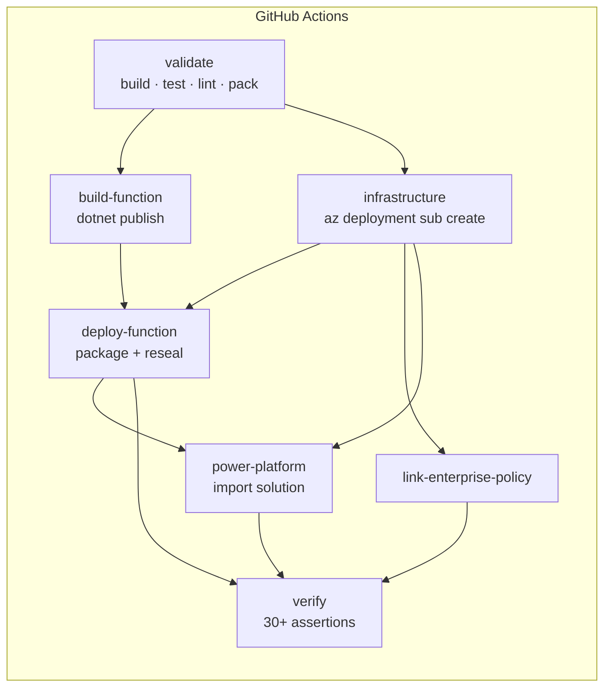

# Architecture

A component-by-component walkthrough of what is deployed, why each piece exists, and how they fit together.

---

## Design principles

1. **The architecture is the product.** The application logic is intentionally trivial so that attention stays on the network and identity model.
2. **Isolated by construction.** One resource group, no shared resources, no hub dependency. Cleanup is a single delete.
3. **Secure by default in the source.** The Bicep declares the locked-down state. Any relaxation is a parameter, is visible in a diff, and is asserted against by CI.
4. **Everything reproducible.** No portal-only configuration except the two items in [limitations.md](limitations.md) that Microsoft's tooling genuinely cannot express.

---

## Component inventory

| Component | Resource type | Why it exists |
| --- | --- | --- |
| Primary virtual network | `Microsoft.Network/virtualNetworks` | Hosts the delegated subnet, the Function integration subnet and the private endpoints |
| Failover virtual network | `Microsoft.Network/virtualNetworks` | Power Platform can fail over between the two Azure regions of its region pair |
| VNet peering (×2) | `.../virtualNetworkPeerings` | Lets the failover region reach the private endpoints in the primary region |
| Private DNS zones (×4) | `Microsoft.Network/privateDnsZones` | Resolve `azurewebsites.net` and storage names to private addresses |
| DNS zone links (×8) | `.../virtualNetworkLinks` | Each zone linked to **both** networks |
| Private endpoints (×4) | `Microsoft.Network/privateEndpoints` | `sites`, `blob`, `queue`, `table` |
| Storage account | `Microsoft.Storage/storageAccounts` | Functions host storage + the Flex Consumption deployment container |
| Log Analytics workspace | `Microsoft.OperationalInsights/workspaces` | Telemetry backing store |
| Application Insights | `Microsoft.Insights/components` | Function telemetry, local auth disabled |
| Flex Consumption plan | `Microsoft.Web/serverfarms` | `FC1` / `FlexConsumption`, `reserved: true` |
| Function App | `Microsoft.Web/sites` | The .NET 10 isolated worker |
| Auth settings | `.../config/authsettingsV2` | Microsoft Entra ID token validation |
| Basic-auth policies (×2) | `.../basicPublishingCredentialsPolicies` | SCM and FTP publishing credentials disabled |
| Role assignments (×4) | `Microsoft.Authorization/roleAssignments` | Data-plane access for the Function identity |
| Enterprise policy | `Microsoft.PowerPlatform/enterprisePolicies` | Binds Power Platform to the delegated subnets |

---

## The Azure Function

**Runtime:** .NET 10, isolated worker model, Functions v4, on Flex Consumption.

The project uses the current `Azure.Functions.Sdk` project SDK:

```xml
<Project Sdk="Azure.Functions.Sdk/1.0.1">
  <PropertyGroup>
    <TargetFramework>net10.0</TargetFramework>
    <TreatWarningsAsErrors>true</TreatWarningsAsErrors>
  </PropertyGroup>
```

The SDK version is pinned in `global.json` under `msbuild-sdks`, which is what makes it resolvable in a clean CI environment.

Flex Consumption is configured through `functionAppConfig` rather than the legacy app settings — on Flex, `FUNCTIONS_WORKER_RUNTIME`, `FUNCTIONS_EXTENSION_VERSION` and `linuxFxVersion` are deprecated:

```bicep
functionAppConfig: {
  deployment: {
    storage: {
      type: 'blobContainer'
      value: deploymentContainerUrl
      authentication: { type: 'SystemAssignedIdentity' }   // no connection string
    }
  }
  scaleAndConcurrency: { maximumInstanceCount: 40, instanceMemoryMB: 2048 }
  runtime: { name: 'dotnet-isolated', version: '10.0' }
}
```

### Code structure

```
SecureRequestClassifier.Functions/
├── Program.cs                           Host builder, DI, options validation
├── host.json                            Logging and route prefix
├── Configuration/
│   ├── ClassifierOptions.cs             Business-rule configuration
│   └── ClassifierOptionsValidator.cs    Fail fast at start-up
├── Endpoints/
│   ├── ClassifyRequestFunction.cs       POST /api/requests/classify
│   └── HealthFunction.cs                GET  /api/health
├── Models/
│   ├── ClassificationRequest.cs
│   ├── ClassificationResponse.cs
│   ├── ValidationProblem.cs             RFC 9457 problem+json
│   └── HealthResponse.cs
└── Services/
    ├── RequestClassifier.cs             The deterministic rules
    ├── RequestValidator.cs              Stateless input validation
    └── CallerIdentityReader.cs          Easy Auth principal parsing
```

### The API

`POST /api/requests/classify`

```json
{
  "requesterName": "Priya Sharma",
  "requesterEmail": "priya@contoso.com",
  "title": "Laptop will not power on after the update",
  "category": "IT",
  "impact": "High",
  "description": "Nothing happens when I press the power button.",
  "correlationId": "optional"
}
```

```json
{
  "requestId": "SRC-20260916-3F7A2B91",
  "status": "Accepted",
  "priority": "P1",
  "priorityRank": 1,
  "assignedTeam": "Digital Workplace Support",
  "normalizedCategory": "IT",
  "normalizedImpact": "High",
  "targetResponseDate": "2026-09-16T14:00:00+00:00",
  "slaBusinessHours": 4,
  "receivedAtUtc": "2026-09-16T10:00:00+00:00",
  "classificationReason": "Category 'IT' with 'High' impact maps to P1; P1 carries a 4 business-hour response target.",
  "notes": [],
  "correlationId": "…"
}
```

| Status | When |
| --- | --- |
| `200` | Classified |
| `400` | Validation failed — `application/problem+json` with a per-field error map |
| `401` | No valid Microsoft Entra ID token (returned by App Service Authentication, not by this code) |
| `403` | Caller application is not allow-listed |
| `405` | Wrong HTTP method |

`GET /api/health` returns status, service name, version, UTC time, runtime description, and whether the caller presented an authenticated principal.

### The rules

Deterministic, by design. No AI, no database, no external call.

**Priority matrix** (category × impact):

| | High | Medium | Low |
| --- | --- | --- | --- |
| **IT** | P1 | P2 | P3 |
| **Facilities** | P2 | P3 | P4 |
| **HR** | P2 | P3 | P4 |
| **Other** | P3 | P3 | P4 |

**SLA:** P1 = 4 business hours, P2 = 8, P3 = 24, P4 = 40.

**Teams:** IT → Digital Workplace Support · Facilities → Workplace Services · HR → People Operations · Other → Business Support Desk.

**Business hours:** Monday–Friday, 09:00–17:00 UTC by default, configurable. A request arriving outside that window starts the clock at the next business-day opening; weekends are skipped entirely.

**Normalisation:** category and impact are matched case-insensitively and trimmed. An **unrecognised category becomes `Other`** with an explanatory note. An **unrecognised impact is rejected** with `400`, because impact drives priority and guessing would be wrong.

**Request ID:** `SRC-{yyyyMMdd}-{8 hex}`, where the suffix is the first four bytes of a SHA-256 over the normalised submission and the received timestamp. Identical inputs at the same instant always produce the same ID — which is what makes the 98 unit tests exact and the demo reproducible.

---

## Identity flow at runtime

1. The user signs in to Power Apps.
2. The app calls the flow. The flow runs as the invoker.
3. The `HTTP with Microsoft Entra ID (preauthorized)` connector requests a token for `api://<apiAppId>` **on behalf of the signed-in user**, using the delegated permission grant created during bootstrap.
4. The connector container in the delegated subnet sends the request with that bearer token.
5. App Service Authentication validates issuer, audience and `allowedApplications`, then injects `X-MS-CLIENT-PRINCIPAL`.
6. The worker reads the principal for logging and optional defence-in-depth checks.

At no point does any component hold a shared secret.

---

## Deployment flow



Every job authenticates with a fresh OIDC token. Nothing is carried between jobs except artefacts and non-secret outputs.

---

## Why these technology choices

| Decision | Alternative considered | Why this one |
| --- | --- | --- |
| Flex Consumption | Elastic Premium | Flex is the only plan that runs fully keyless: managed identity for host blobs, queues *and* tables, with no Azure Files share requiring a shared key |
| .NET 10 isolated | .NET 8 in-process | In-process cannot run .NET 10 at all, and its support ends in November 2026 |
| `HTTP with Microsoft Entra ID (preauthorized)` | Plain HTTP action | Only the former is on Microsoft's VNet supported-services list; the plain action would not egress from the delegated subnet |
| Easy Auth | Validating tokens in code | Keeps signing keys, JWKS caching and issuer validation out of the application entirely, and needs no secret |
| System-assigned identity | User-assigned | One identity, one lifecycle, deleted with the app. Nothing here needs identity reuse |
| Workload-owned private DNS zones | Hub zones | The isolation requirement. `createPrivateDnsZones` exists for landing zones that own them centrally |
| Two virtual networks | One | Not optional — Microsoft requires a delegated subnet in both Azure regions of a paired geography |
| One resource group | Several | Makes cleanup provably complete and safe |
| Subscription-scope deployment | Resource-group scope | Lets the template create its own resource group, so a single command deploys everything |

---

## Cost

Approximate, at demo volume, in a public Azure region:

| Resource | Driver | Order of magnitude |
| --- | --- | --- |
| Flex Consumption plan | per execution + GB-seconds | pennies |
| Storage account | a few MB, minimal transactions | pennies |
| Log Analytics | capped at 1 GB/day; realistically far less | low single digits per month |
| Private endpoints ×4 | hourly charge each | the largest single line item |
| Virtual networks, peering (intra-region), DNS zones | mostly free at this scale | negligible |
| Enterprise policy | no charge | free |

Deleting the resource group stops all of it.
