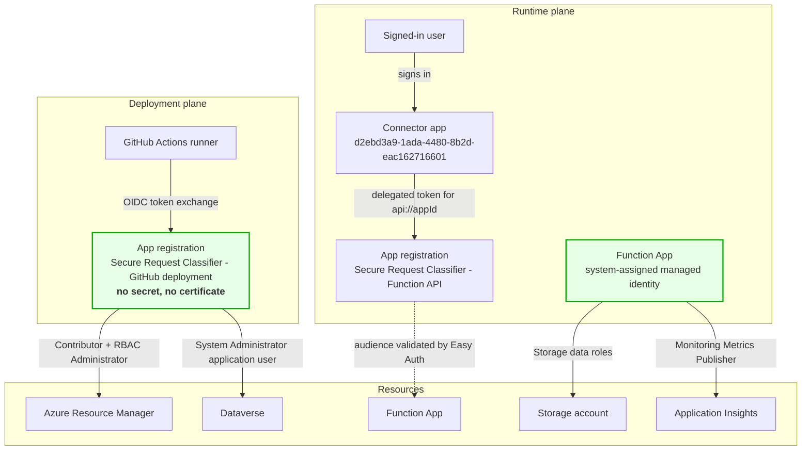

# Identity model

Five identities. Each one exists for a single job and can do nothing else.

---

## Overview



---

## 1. The GitHub Actions deployment identity

**Type:** Microsoft Entra ID app registration
**Credential:** none. Three federated identity credentials, no client secret, no certificate.

### Federated credentials

| Name | Subject | Grants tokens to |
| --- | --- | --- |
| `github-branch-main` | `repo:<owner>/<repo>:ref:refs/heads/main` | runs on `main` |
| `github-pull-request` | `repo:<owner>/<repo>:pull_request` | pull-request validation |
| `github-environment-demo` | `repo:<owner>/<repo>:environment:demo` | jobs bound to the `demo` GitHub environment |

Issuer `https://token.actions.githubusercontent.com`, audience `api://AzureADTokenExchange`.

### How the exchange works

1. The job declares `permissions: id-token: write`.
2. GitHub mints a short-lived JWT whose `sub` claim is one of the three subjects above.
3. `azure/login@v3` presents that JWT to Microsoft Entra ID.
4. Entra ID matches issuer + subject + audience against a federated credential and issues an access token.

Nothing long-lived exists to be stolen, and the trust is pinned to this repository, this branch and this environment.

### What it can do

| Scope | Role | Why |
| --- | --- | --- |
| Subscription | **Contributor** | Create the resource group and everything in it |
| Subscription | **Role Based Access Control Administrator** | `Contributor` cannot create role assignments; this role is strictly narrower than both `Owner` and `User Access Administrator` |
| Power Platform environment | Dataverse application user with **System Administrator** | Import solutions |
| Directory | **Power Platform Administrator** | Link the enterprise policy |

### Tightening it

* Put **required reviewers** on the `demo` GitHub environment, so a human approves before a token is minted at all.
* Add an ABAC condition to the RBAC Administrator assignment restricting which role definitions it may assign — the exact command is in [security-model.md](security-model.md#the-deployment-identity-avoids-owner).
* Remove the `pull_request` credential if pull requests never need Azure access.
* Scope `Contributor` to a pre-created resource group instead of the subscription, if you create the group separately.

---

## 2. The Function App managed identity

**Type:** system-assigned managed identity
**Credential:** none; the platform handles it.

### What it can do

| Scope | Role | Used for |
| --- | --- | --- |
| Its own storage account | Storage Blob Data Owner | Host blobs, lease management, the deployment package |
| Its own storage account | Storage Queue Data Contributor | Functions host queues |
| Its own storage account | Storage Table Data Contributor | Functions host tables |
| Its own Application Insights | Monitoring Metrics Publisher | Telemetry with `Authorization=AAD` |

Four data-plane roles, each scoped to a single resource. **No control-plane role at all** — it cannot read another resource, create anything, or modify its own configuration.

`Test-Deployment.ps1` fails if this identity is ever found holding Owner, Contributor or User Access Administrator.

### How the app uses it

```
AzureWebJobsStorage__accountName      = <storage>
AzureWebJobsStorage__blobServiceUri   = https://<storage>.blob.core.windows.net
AzureWebJobsStorage__queueServiceUri  = https://<storage>.queue.core.windows.net
AzureWebJobsStorage__tableServiceUri  = https://<storage>.table.core.windows.net
AzureWebJobsStorage__credential       = managedidentity
APPLICATIONINSIGHTS_AUTHENTICATION_STRING = Authorization=AAD
```

There is no connection string anywhere in the configuration, and `allowSharedKeyAccess: false` on the account means one would not work if there were.

---

## 3. The Function API app registration

**Type:** Microsoft Entra ID app registration
**Credential:** none — this identity is never used to *authenticate*. It exists to be a token **audience**.

| Property | Value |
| --- | --- |
| Application ID URI | `api://<appId>` |
| Exposed scope | `user_impersonation` (delegated) |
| `requestedAccessTokenVersion` | `2` |
| Pre-authorized application | the connector app |

App Service Authentication references it by client ID and validates three things independently:

1. **Issuer** — `https://login.microsoftonline.com/<tenant>/v2.0`
2. **Audience** — `api://<appId>` or `<appId>`
3. **Allowed application** — the token's `azp`/`appid` claim must be on the list

These combine with a logical AND. A token for a different API, from a different tenant, or from a different application, is rejected.

**No client secret is required** because the app never initiates a sign-in flow. It returns `401` and stops. Token storage is disabled for the same reason.

---

## 4. The HTTP with Microsoft Entra ID connector

**Type:** Microsoft first-party multi-tenant application
**Application ID:** `d2ebd3a9-1ada-4480-8b2d-eac162716601`

Microsoft publishes this value in [`ManagePermissionGrant.ps1`](https://github.com/microsoft/PowerApps-Samples/blob/master/powershell/connectors/HTTPWithMicrosoftEntraId/ManagePermissionGrant.ps1), which its connector documentation links to, as `$HttpWithAADAppAppId`. Microsoft's own tooling refers to it as `ServiceApp_NoPreAuths` — the newer connector app that carries **no** built-in preauthorization, so an administrator must grant discrete consent.

### What it can do

Exactly one thing: obtain a delegated token for `api://<apiAppId>` with the `user_impersonation` scope, on behalf of a signed-in user.

That is enabled by an `oauth2PermissionGrant`:

```json
{
  "clientId":    "<connector service principal object id>",
  "consentType": "AllPrincipals",
  "resourceId":  "<API service principal object id>",
  "scope":       "user_impersonation"
}
```

`AllPrincipals` means users are not prompted individually. Change it to `Principal` with a specific `principalId` to restrict it to named users.

### Why this connector

It is the only HTTP-style connector on Microsoft's supported-services list for Power Platform VNet support. Its traffic egresses from the delegated subnet; the plain HTTP action's does not.

Two constraints that follow:

* Under VNet support, the **Get web resource** action is unsupported. The flow uses **Invoke an HTTP request** (`InvokeHttp`).
* The connection is a **delegated user** connection. There is no service-principal option without a certificate secret. See [limitations.md](limitations.md#2-the-connector-connection-must-be-created-once-by-a-person).

---

## 5. The signed-in user

**Type:** Microsoft Entra ID user

The user signs in to Power Apps, the flow runs as the invoker, and the connector acquires a token *on their behalf*. Their identity reaches the Function App in the `oid` claim of the client principal and is written to every log entry.

This means the audit trail identifies the human, not a shared service account — which is usually the right answer for a request-submission workflow, and is a natural consequence of the connector's delegated model rather than something the demo had to build.

---

## Credential inventory

The complete list of long-lived credentials in this solution:

| Credential | Where it lives |
| --- | --- |
| *(none)* | — |

Every authentication path is either a federated token exchange, a platform-managed identity, or a delegated user token. There is nothing to rotate, nothing to expire, and nothing to leak.

The `security-invariants` CI job fails the build if that ever stops being true.

---

## Identity lifecycle

| Identity | Created by | Removed by |
| --- | --- | --- |
| Deployment app registration | `Initialize-EntraResources.ps1` | `Remove-Demo.ps1` (by default; `-KeepEntraApplications` keeps it) |
| API app registration | `Initialize-EntraResources.ps1` | `Remove-Demo.ps1` (by default; `-KeepEntraApplications` keeps it) |
| Function managed identity | Bicep, with the Function App | deleting the resource group |
| Connector service principal | `Initialize-EntraResources.ps1` if absent | **deliberately never removed** — it is a shared tenant-wide Microsoft application and other solutions may depend on it |
| Delegated permission grant | `Initialize-EntraResources.ps1` | **deliberately never removed** — removing it could break other solutions using the same connector |

The last two are called out in the cleanup script's output so the decision is visible rather than silent.
